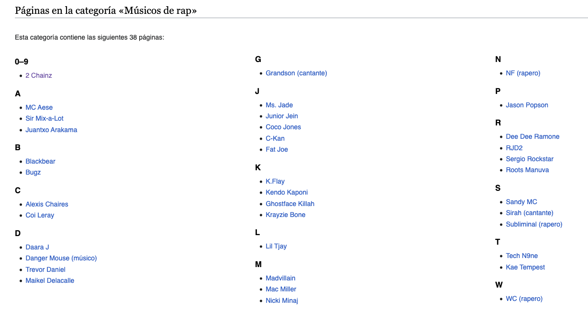
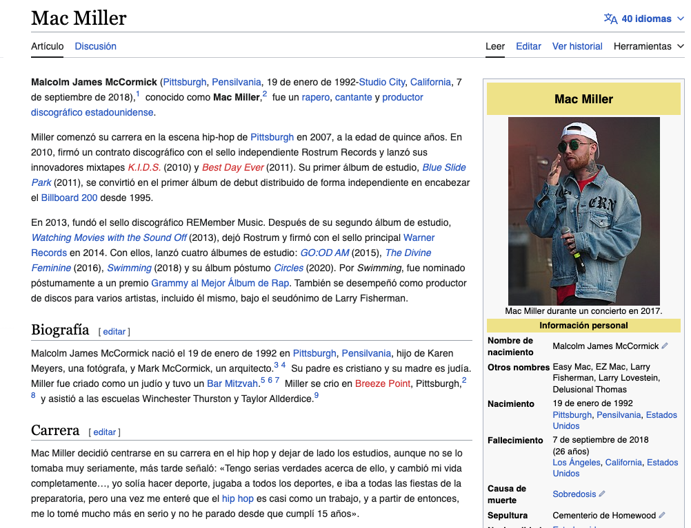

## Ejercicio de Scraping con Cheerio, Axios y Express

El objetivo de este ejercicio es crear una aplicación Node.js con Express que realice scraping de datos de la Wikipedia. En particular, se busca obtener información sobre músicos de rap a partir de la categoría correspondiente en la Wikipedia en español. Esta es la URL que debes usar 
`const url = 'https://es.wikipedia.org/wiki/Categor%C3%ADa:M%C3%BAsicos_de_rap'`

# Pasos a Seguir:
- Paso 1: Inicializar el Proyecto
Inicia con npm install para instalar las dependencias (express, cheerio, axios).

- Paso 2: Crear un Archivo `index.js`
Crea un archivo llamado index.js en el directorio del proyecto.
Aquí estará todo el código de tu proyecto

- Paso 3: Crear un servidor http

- Paso 4: Accederemos a la web de wikipedia (`https://es.wikipedia.org/wiki/Categor%C3%ADa:M%C3%BAsicos_de_rap`), en esa web encontraremos enlaces a los que tendremos que acceder y recorrer esas página y recoger los siguinetes datos:
  - El título (h1)
  - Todas las imágenes ('img')
  - Todos los textos ('p') 

**Enlaces**

**Ejemplo de página dentro de uno de los enlaces**

- Paso 5:
Crea un array y dentro guarda cada uno de los datos de las páginas en un objeto (título, imagenes, textos)

- Paso 6:
Saca toda esa información en un console.log() cuando todo termine, o en un res.send() en la misma ruta o en otra... donde decidas

## PISTAS:
- Prueba primero un scraping sencillo para ver que está trayendo algo. Por ejemplo el título de la página inicial. Si eso funciona prosigue recorriendo páginas interiores
- Para recoger los enlaces, deberás recoger solo los que están dentro del ID: `#mw-pages`. Será algo así: `$('#mw-pages a').each((index, element)`...
- Para poder entrar en cada URL interior primero tendrás que traer todas las URLs donde quieres entrar y a partir de ahí recorrerlas con otro bucle para poder pasar los datos.
- Cuando se hace un scraping "grande", tarda en responder así que es importante ver si resuelve algo poniendo algún console log en cada uno de los bucles para ver que está haciendo algo nuestro scraping.
- Recuerda que hasta que no entres en la ruta no se ejecutará el scraping. Es decir si tu puesto es el 3000 hasta que no entres en 'localhost:3000' no se ejecutará nada

Aquí tienes la documentación de Cheerio: https://cheerio.js.org/docs/intro
Aquí tienes la documentación de Axios: https://axios-http.com/es/docs/intro